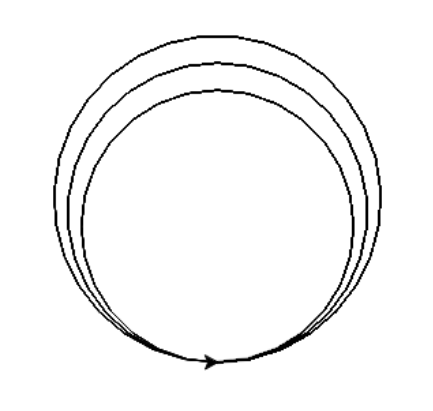

# Практична робота 8
1. Запустити програму IDLE (в меню Пуск -> Python -> IDLE)
2. Створити новий файл (File -> New File)
3. Зберегти файл (File -> Save File As...)
4. Набрати програму зі сторінки 64 підручника (завдання 3)
5. Запустити програму на виконання (Run -> Run Module)
6. Переконатися, що появилося вікно, зображене в правій частині завдання в підручнику


# Практична робота 9
1. Запустити програму IDLE (в меню Пуск -> Python -> IDLE)
2. Створити новий файл (File -> New File)
3. Зберегти файл (File -> Save File As...)
4. Набрати програму зі сторінки 65 підручника (завдання 6, пункт 3) або змінити код із попередньої практичної роботи
5. Запустити програму на виконання (Run -> Run Module)
6. Переконатися, що появилося вікно, зображене в правій частині завдання в підручнику
7. Натиснути на кнопку у вікні, що появилося
8. Перевірити що відбувається у вікні IDLE Shell при натисканні кнопки у вікні, що появилося
9. Змінити текст "Ok!" на "Привіт!"
10. Запустити програму на виконання (Run -> Run Module)
11. Перевірити що відбувається у вікні IDLE Shell при натисканні кнопки
12. Пояснити кожен рядок програми


# Практична робота 10
1. Запустити програму IDLE (в меню Пуск -> Python -> IDLE)
2. Створити новий файл (File -> New File)
3. Зберегти файл (File -> Save File As...)
4. Набрати програму зі сторінки 70 підручника (завдання 1)
5. Запустити програму на виконання (Run -> Run Module)
6. Переконатися, що появилося вікно з кнопкою
7. Змінити розміри вікна із "450x350" на "600x500"
8. Запустити програму на виконання (Run -> Run Module) і переконатися, що вікно змінило розміри
9. Змінити положення кнопки із x=100, y=150 на x=300, y=200  
10. Запустити програму на виконання (Run -> Run Module) і переконатися, що кнопка змінила положення
11. Змінити розміри кнопки із width=200, height=50 на width=300, height=100
12. Запустити програму на виконання (Run -> Run Module) і переконатися, що кнопка змінила розміри
13. Пояснити кожен рядок програми


# Практична робота 11
1. Запустити програму IDLE (в меню Пуск -> Python -> IDLE)
2. Створити новий файл (File -> New File)
3. Зберегти файл (File -> Save File As...)
4. Набрати програму зі сторінки 71 підручника (завдання 3) або змінити код із попередньої практичної роботи
5. Запустити програму на виконання (Run -> Run Module)
6. Переконатися, що появилося вікно із текстовим полем і кнопкою
7. Натиснути на кнопку у вікні, що появилося, перевірити що відбувається у вікні IDLE Shell при натисканні кнопки у вікні, що появилося
9. Змінити текст "print("Привіт,")" на "print("Привіт,", ent.get())"
10. Запустити програму на виконання (Run -> Run Module)
11. Ввести своє ім'я в текстове поле і натиснути кнопку
12. Перевірити що відбувається у вікні IDLE Shell при натисканні кнопки
13. Пояснити кожен рядок програми




# Практична робота 12

1. Запустити програму IDLE (в меню Пуск -> Python -> IDLE)
2. Створити новий файл (File -> New File)
3. Зберегти файл (File -> Save File As...)
4. Скопіювати і вставити наступний код

```python
from tkinter import *
from turtle import *

def draw_graphics():
    # Малюємо 
    t.forward(100)
    t.right(90)

def clear_graphics():
    # Очищуємо екран
    t.clear()

# Глобальне вікно turtle та черепашка
screen = Screen()
screen.setup(width=800, height=600)

t = Turtle()  # Створюємо черепашку

# Головна програма Tkinter
tk = Tk()

# Додаємо кнопки
button_draw = Button(tk, text="Намалювати", command=draw_graphics)
button_draw.pack(pady=10)

button_clear = Button(tk, text="Очистити екран", command=clear_graphics)
button_clear.pack(pady=10)

# Запускаємо головний цикл Tkinter
tk.mainloop()
```

5. Запустити програму на виконання (Run -> Run Module)
6. Переконатися, що появилося вікно із кнопками і вікно для малювання
7. Натиснути на кнопки у вікні, перевірити що відбувається
8. Змінити програму так, щоб при натисканні кнопки було зображено коло (можна скористатися довідкою https://pythonsandbox.com/docs/turtle)
9. Пояснити кожен рядок програми

# Практична робота 13

1. Запустити програму IDLE (в меню Пуск -> Python -> IDLE)
2. Створити новий файл (File -> New File)
3. Зберегти файл (File -> Save File As...)
4. Скопіювати і вставити код із попередньої практичної роботи
5. Додати кнопку і назвати її "Квадрат"
6. Написати функцію `draw_k()`, яка будує квадрат
7. Зробити так, щоб при натисканні на кнопку "Квадрат" був зображений квадрат

# Практична робота 14

1. Запустити програму IDLE (в меню Пуск -> Python -> IDLE)
2. Створити новий файл (File -> New File)
3. Зберегти файл (File -> Save File As...)
4. Скопіювати і вставити наступний код

```python
from tkinter import *
tk = Tk()
tk.geometry("300x250")

def click():
    label_greeting.config(text="Привіт,"+entry1.get())

label1 = Label(text="Ім'я")
entry1 = Entry()    

btn = Button(text="Привітання", command=click)

label_greeting = Label()

label1.place(x=50, y=20, width=110, height=35)
entry1.place(x=150, y=20, width=110, height=35)
btn.place(x=100, y=100, width=110, height=35)
label_greeting.place(x=100, y=140, width=110, height=35)
```

5. Запустити програму на виконання (Run -> Run Module)
6. Переконатися, що появилося вікно із текстовим полем і кнопкою
7. Ввести ім'я у текстове поле і натиснути на кнопку. Переконатися, що появиться привітання
8. Пояснити кожен рядок коду
9. Змінити програму так, щоб появилося поле "Прізвище" і при введенні імені і прізвища та натисканні кнопки виводилося відповідне привітання

# Практична робота 15

1. Запустити програму IDLE (в меню Пуск -> Python -> IDLE)
2. Створити новий файл (File -> New File)
3. Зберегти файл (File -> Save File As...)
4. Скопіювати і вставити наступний код
   
```python
from tkinter import *
from turtle import *

def draw_graphics():
    # Малюємо
    x = entry.get()
    x = int(x)
    t.forward(x)
    t.right(90)

def clear_graphics():
    # Очищуємо екран
    t.clear()

# Глобальне вікно turtle та черепашка
screen = Screen()
screen.setup(width=800, height=600)

t = Turtle()  # Створюємо черепашку

# Головна програма Tkinter
tk = Tk()

# Додаємо текстове поле
entry = Entry(tk)
entry.pack(pady=10)

# Додаємо кнопки
button_draw = Button(tk, text="Намалювати", command=draw_graphics)
button_draw.pack(pady=10)

button_clear = Button(tk, text="Очистити екран", command=clear_graphics)
button_clear.pack(pady=10)

# Запускаємо головний цикл Tkinter
tk.mainloop()
```

5. Запустити програму на виконання (Run -> Run Module)
6. Переконатися, що появилося вікно із текстовим полем і кнопками
7. Ввести число 100 у текстове поле і натиснути кнопку "Намалювати". Переконатися, що буде побудовано відрізок
8. Змінити число на 50 у текстовому полі і натиснути кнопку "Намалювати". Переконатися, що буде побудовано відрізок меншої довжини
10. Пояснити кожен рядок коду

# Практична робота 16

1. Відкрити код із попередньої роботи
2. Додати кнопку і назвати її "Коло". Таким чином має бути три кнопки
3. Зробити так, щоб при натисканні на кнопку "Коло" було побудоване коло із радіусом, введеним у текстове поле
4. Продемонструвати роботу програми
5. Пояснити кожен рядок коду

# Практична робота 17

1. Відкрити код із роботи 15
2. Додати ще одне текстове поле
3. Змінити назву кнопки "Намалювати" на "Прямокутник"
4. Зробити так, щоб при натисканні на кнопку "Прямокутник" було побудовано прямокутник із довжиною, введеною у перше текстове поле, і шириною, введеною у друге текстове поле
5. Продемонструвати роботу програми
6. Пояснити кожен рядок коду

# Практична робота 18

1. Запустити програму IDLE (в меню Пуск -> Python -> IDLE)
2. Створити новий файл (File -> New File)
3. Зберегти файл (File -> Save File As...)
4. Скопіювати і вставити наступний код

```python
from tkinter import *
from turtle import *


def draw_graphics():
    # Малюємо
    x = entry1.get()
    x = int(x)
    t.left(90)
    t.forward(x)

def clear_graphics():
    # Очищуємо екран
    t.clear()

# Глобальне вікно turtle та черепашка
screen = Screen()
screen.setup(width=800, height=600)

t = Turtle()  # Створюємо черепашку


tk = Tk()
tk.geometry("400x300")


label1 = Label(tk, text="Довжина сходинки:")
label1.pack()  
entry1 = Entry(tk)
entry1.pack()  

label2 = Label(tk, text="Кількість сходинок:")
label2.pack()  
entry2 = Entry(tk)
entry2.pack()

# Кнопка "Намалювати сходи"
button_draw = Button(tk, text="Намалювати сходи", command=draw_graphics)
button_draw.pack()

# Кнопка "Очистити екран"
button_clear = Button(tk, text="Очистити екран", command=clear_graphics)
button_clear.pack()

# Запуск програми
tk.mainloop()
```
5. Дописати код так, щоб при натисканні кнопки було побудовано введену кількість сходинок. Інформацію про цикли можна знайти тут https://www.w3schools.com/python/python_for_loops.asp
6. Змінити код так, щоб були поля для введення ширини і висоти сходинки. Сходи мають будуватися згідно із цими розмірами

# Практична робота 19

1. Запустити програму IDLE (в меню Пуск -> Python -> IDLE)
2. Створити новий файл (File -> New File)
3. Зберегти файл (File -> Save File As...)
4. Скопіювати і вставити наступний код

```python
import turtle

# Створення екрану та черепашки
screen = turtle.Screen()
screen.title("Обробка клавіш")
screen.setup(width=600, height=600)
t = turtle.Turtle()
t.speed(0)

# Функції для обробки натискання клавіш
def move_up():
    t.setheading(90)
    t.forward(20)

def move_down():
    t.setheading(270)
    t.forward(20)

def move_left():
    t.setheading(180)
    t.forward(20)

def move_right():
    t.setheading(0)
    t.forward(20)

# Зв'язування клавіш зі стрілками
screen.listen()  # Активує обробку подій клавіатури
screen.onkey(move_up, "Up")
screen.onkey(move_down, "Down")
screen.onkey(move_left, "Left")
screen.onkey(move_right, "Right")

# Запуск головного циклу
screen.mainloop()
```
5. Пояснити кожен рядок коду. Функцію setheading можна знайти https://www.pythonsandbox.com/docs/turtle
6. Дописати код так, щоб при натисканні: клавіші зі стрілкою вліво було повернуто курсор на 15 градусів вліво, клавіші зі стрілкою вправо було повернуто курсор на 15 градусів вправо, клавіші зі стрілкою вгору курсор рухався вперед, клавіші зі стрілкою вниз курсор повертався на 180 градусів. 
